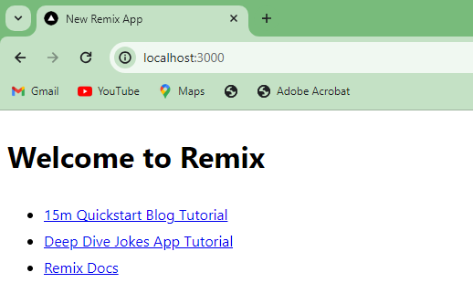
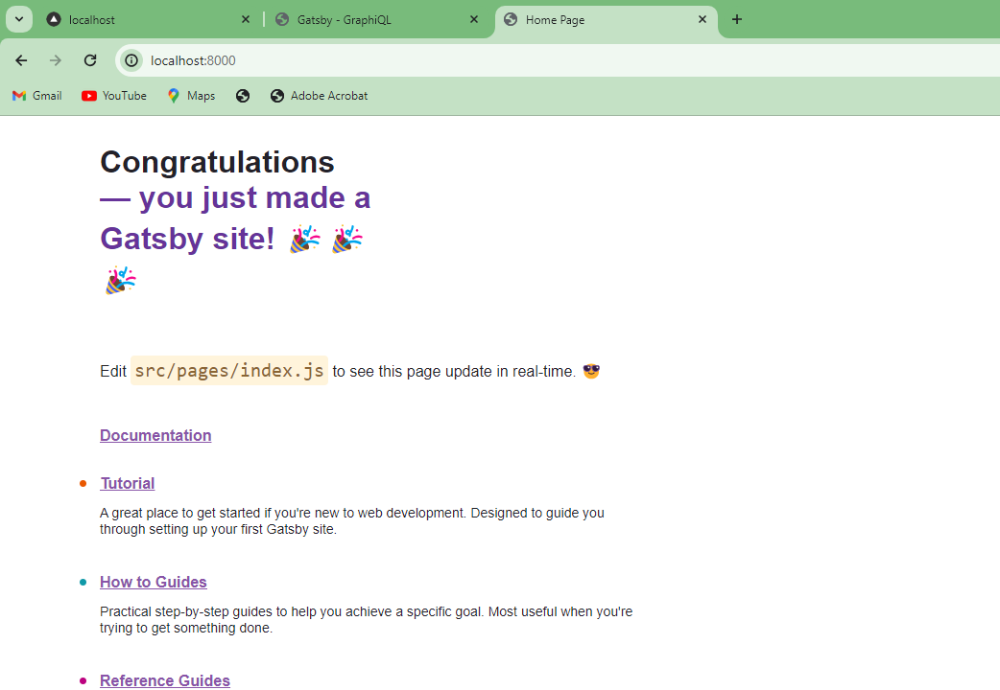
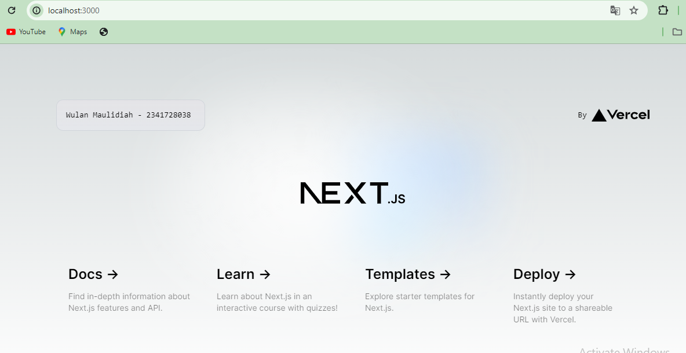
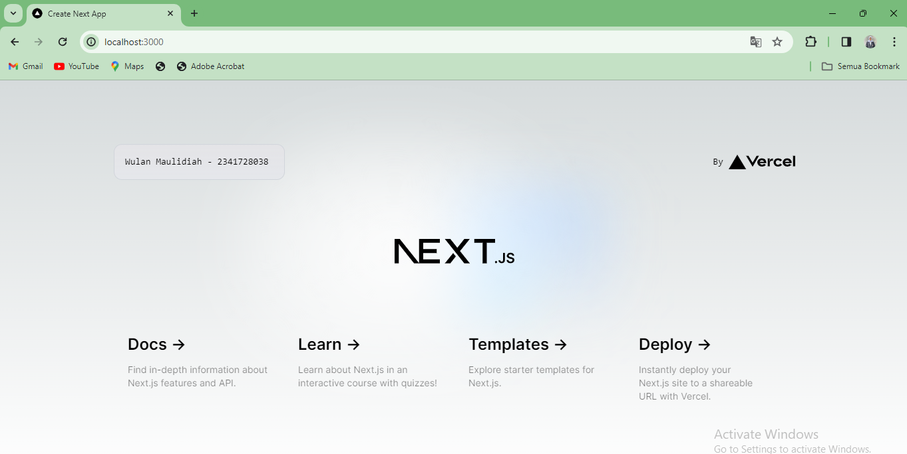
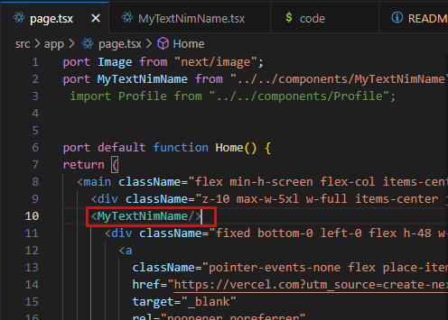
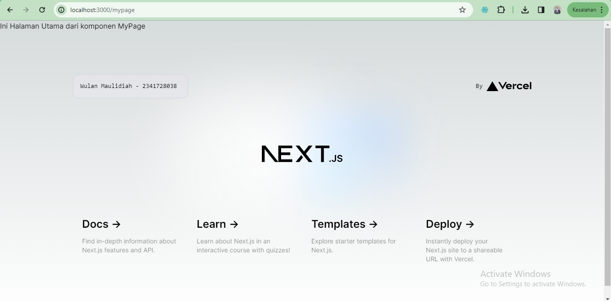
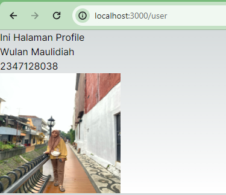

This is a [Next.js](https://nextjs.org/) project bootstrapped with [`create-next-app`](https://github.com/vercel/next.js/tree/canary/packages/create-next-app).

## Getting Started

First, run the development server:

```bash
npm run dev
# or
yarn dev
# or
pnpm dev
# or
bun dev
```

Open [http://localhost:3000](http://localhost:3000) with your browser to see the result.

You can start editing the page by modifying `app/page.tsx`. The page auto-updates as you edit the file.

This project uses [`next/font`](https://nextjs.org/docs/basic-features/font-optimization) to automatically optimize and load Inter, a custom Google Font.

## Laporan Praktikum

Jawaban Soal 1
- Typescript adalah bahasa pemrograman berbasis JavaScript yang menambahkan fitur strong-typing & konsep pemrograman OOP klasik ( class, interface). Di dalam dokumentasinya, TypeScript disebut sebagai super-set dari JavaScript, artinya semua kode JavaScript adalah kode TypeScript juga. Bahasa pemrograman ini menawarkan class, module, dan interface yang membuat developer bisa mengembangkan aplikasi kompleks dengan lebih mudah. Hal inilah yang membedakannya dengan javascript.
- ESLint adalah sebuah tools untuk melakukan static analyzes kode kita agar kita tau dengan cepat menemukan masalah atau potensi bug dari kode yang sudah kita buat.
- Tailwind CSS adalah sebuah framework CSS yang mengutamakan penggunaan kelas-kelas utilitas untuk membangun antarmuka pengguna. Berbeda dengan pendekatan tradisional menggunakan CSS prapenyesuaian, Tailwind CSS memungkinkan pengembang untuk membangun tampilan dengan menambahkan kelas-kelas langsung ke dalam HTML. Ini membuat pengembangan lebih cepat dan memungkinkan untuk mempertahankan konsistensi gaya dengan lebih baik.
- App Router adalah bagian dari sebuah aplikasi web atau aplikasi lain yang bertanggung jawab untuk mengelola navigasi antara berbagai halaman atau komponen dalam aplikasi. Ini terutama relevan dalam konteks aplikasi web berbasis satu halaman (single-page applications) di mana navigasi dilakukan tanpa memuat ulang seluruh halaman. App Router memetakan URL ke komponen-komponen yang sesuai dan memberikan pengalaman navigasi yang mulus kepada pengguna.
- Import Alias adalah cara untuk membuat penggunaan import dalam JavaScript lebih bersih dan lebih mudah dimengerti. Aliases memberikan nama alternatif untuk modul atau berkas yang diimpor, yang memungkinkan pengembang untuk mengimpor modul-modul dengan nama yang lebih deskriptif atau pendek. Ini juga memungkinkan untuk menyembunyikan detail implementasi dari lokasi aktual modul tersebut dalam struktur proyek. Aliases sering digunakan untuk menghindari penulisan jalan berkas yang panjang atau memperbaiki dependensi ketika struktur proyek berubah.

Perbedaan Next.js, Remix, dan Gatsby

Next.js, dengan fokus pada fleksibilitas, memberikan pengembang berbagai opsi untuk membangun aplikasi web, termasuk SSR dan SSG, sementara Remix menawarkan integrasi penuh antara sisi klien dan sisi server dalam pendekatan "Full Stack React", dan Gatsby memungkinkan pembangunan situs web statis yang cepat dengan menyediakan berbagai fitur dan plugin-plugin yang mempercepat proses pengembangan. Selain itu, gatsby menggunkan konsep "generate once, serve everywhere" di mana halaman-halaman situs web dibangun selama proses pembangunan dan disajikan sebagai berkas statis kepada pengguna.

Bukti Setup Remix Berhasil


Bukti Setup Gatsby Berhasil


Jawaban Soal 2
- Folder .next adalah folder output yang dihasilkan oleh Next.js setelah proses pembangunan (build). Ini berisi file-file seperti halaman yang telah di-render, file-file statis yang telah dioptimalkan, dan hasil lain dari proses pembangunan proyek Next.js.
- Folder node_modules merupakan folder yang menyimpan semua paket dan dependensi yang diperlukan dalam membuat sebuah proyek react. Paket yang dimaksud termasuk paket-paket seperti React, Next.js, dan paket-paket lain yang telah diinstal menggunakan npm atau Yarn.
- Folder public merupakan folder yang berisi berkas statis seperti gambar, favicon, atau file lainnya yang akan diakses secara langsung oleh klien. Konten dalam folder ini akan disajikan pada akar domain sebuah situs.
- Folder src\app merupakan struktur yang disesuaikan untuk proyek tertentu dan mungkin tidak selalu hadir dalam setiap proyek Next.js. Biasanya, folder ini berisi kode JavaScript atau TypeScript yang terkait langsung dengan logika aplikasi, seperti manajemen status global (global state management), konfigurasi aplikasi, fungsi utilitas, atau struktur organisasi khusus lainnya. Isi folder ini dapat bervariasi tergantung pada preferensi pengembang atau struktur proyek yang ditetapkan.
- File .eslintrc.json merupakan file yang berisi konfigurasi untuk ESLint, alat linting JavaScript. Ini digunakan untuk menentukan aturan linting dan konfigurasi lainnya yang akan diterapkan pada kode JavaScript dalam sebuah proyek.
- File .gitignore merupakan file yang digunakan untuk menentukan daftar file dan folder yang akan diabaikan oleh Git. Ini umumnya digunakan untuk menghindari menyertakan file-file sementara atau yang dihasilkan secara otomatis dalam repositori Git.
- File next-env.d.ts adalah file deklarasi TypeScript yang secara khusus digunakan dalam proyek Next.js. Fungsi utamanya adalah untuk memastikan bahwa TypeScript mengenali dan memahami berbagai modul dan konfigurasi yang terkait dengan Next.js secara tepat.
- File next.config.mjs merupakan file konfigurasi khusus untuk Next.js yang memungkinkan kita untuk menambahkan pengaturan kustom, menentukan pengaturan server, dan lain-lain.
- File package-lock.json berfungsi untuk memastikan konsistensi instalasi paket-paket npm di berbagai lingkungan dan untuk memperbaiki versi paket yang digunakan dalam sebuah proyek.
- File package.json merupakan file konfigurasi untuk proyek Node.js. Ini berisi informasi tentang proyek yang dibuat seperti nama, versi, dependensi, skrip, dan lain-lain. Ini juga mencatat dependensi yang diperlukan dalam sebuah proyek.
- File postcss.config.js adalah file konfigurasi untuk PostCSS, yang merupakan alat pengolah CSS yang kuat dan fleksibel. PostCSS digunakan untuk melakukan transformasi pada kode CSS dengan berbagai plugin, memungkinkan Anda untuk menulis kode CSS dengan sintaks modern dan melakukan otomatisasi proses tertentu.
- File README.md merupakan file teks yang berisi dokumentasi atau informasi penting tentang sebuah proyek.
- File tailwind.config.ts digunakan dalam proyek yang menggunakan Tailwind CSS untuk mengonfigurasi dan menyesuaikan berbagai aspek dari kerangka kerja Tailwind CSS
- File tsconfig.json adalah file konfigurasi untuk TypeScript Compiler (tsc). Ini digunakan untuk mengatur berbagai opsi dan pengaturan yang berkaitan dengan proses kompilasi TypeScript dalam sebuah proyek.

Jawaban Soal 3

Dalam melakukan perubahan data pada proyek Next.js, kita tidak perlu lagi melakukan menjalankan kembali perintah "npm run dev" atau melakukan reload halaman kembali di browser. Hal ini bisa terjadi karena Next.js menyediakan fitur Hot Module Replacement (HMR) yaitu sebuah mekanisme yang memungkinkan perubahan pada kode sumber yang diterapkan secara langsung ke aplikasi web tanpa perlu mereload kembali. Beberapa file konfigurasi, seperti next.config.js untuk konfigurasi Next.js dan tsconfig.json untuk konfigurasi TypeScript ini berpengaruh dalam perilaku Hot Module Replacement.


Jawaban Soal 4

Jika menyesuaikan kode yang digunakan pada nomor 3, kemudian dibuatkan komponen baru lalu komponen tersebut dipanggil pada halaman utama, sebenarnya tidak memberikan perubahan pada tampilan halaman utama. Hal ini bisa terjadi karena komponen-komponen dalam React adalah komponen mandiri dan tidak menyimpan state atau konteks aplikasi secara global. Perubahan tampilan halaman dapat terjadi hanya saja jika kita melakukan pemanggilan komponen kemudian meletakkan komponen tersebut pada posisi yang berbeda dari sebelumnya.



Jawaban Soal 5

Dalam tampilan tersebut tidak ada perubahan karena kode-kode HTML yang dimasukkan dalam komponen MyPage() yang dipanggil adalah sama dengan yang ada pada file page.tsx sebelumnya. Bedanya hanya terdapat pada kalimat diatasnya yang digunakan sebagai penanda bahwa halaman tersebut memanggil komponen MyPage.


Jawaban Soal 6


- [Next.js Documentation](https://nextjs.org/docs) - learn about Next.js features and API.
- [Learn Next.js](https://nextjs.org/learn) - an interactive Next.js tutorial.

You can check out [the Next.js GitHub repository](https://github.com/vercel/next.js/) - your feedback and contributions are welcome!

## Deploy on Vercel 

The easiest way to deploy your Next.js app is to use the [Vercel Platform](https://vercel.com/new?utm_medium=default-template&filter=next.js&utm_source=create-next-app&utm_campaign=create-next-app-readme) from the creators of Next.js.

Check out our [Next.js deployment documentation](https://nextjs.org/docs/deployment) for more details.
